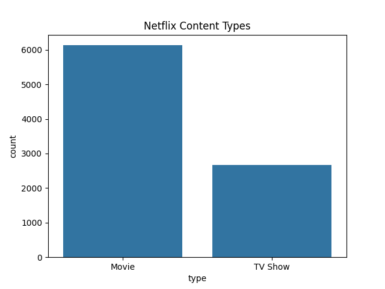
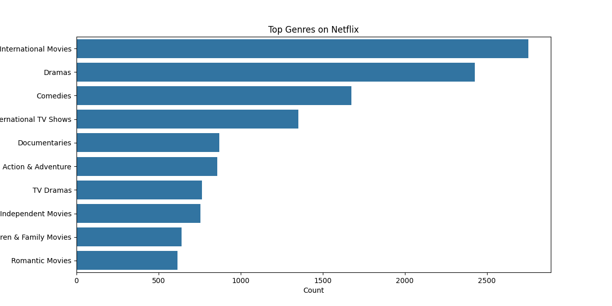
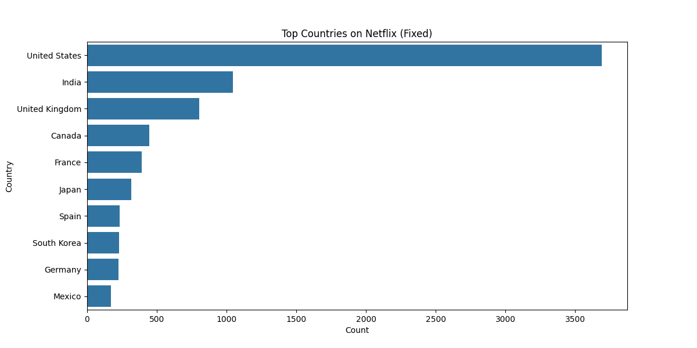
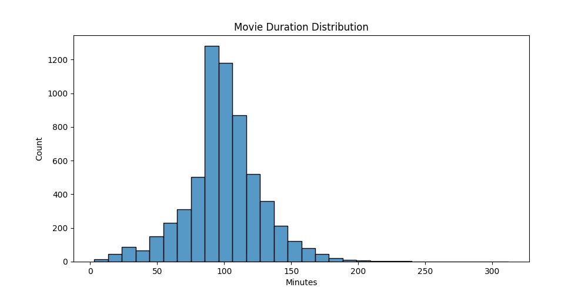
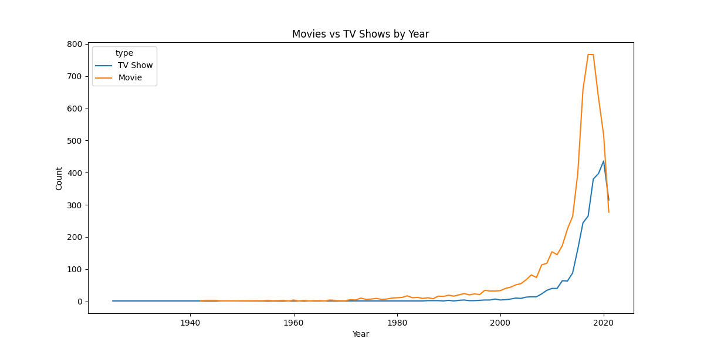
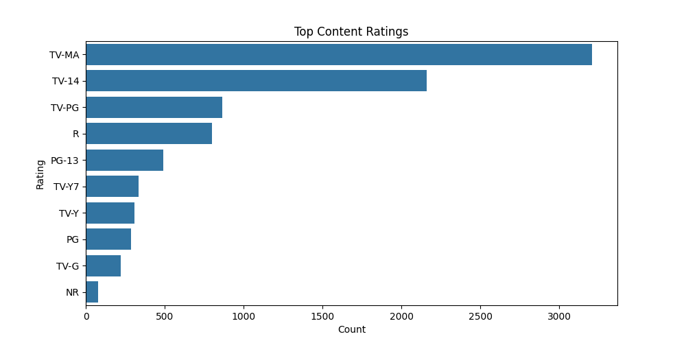
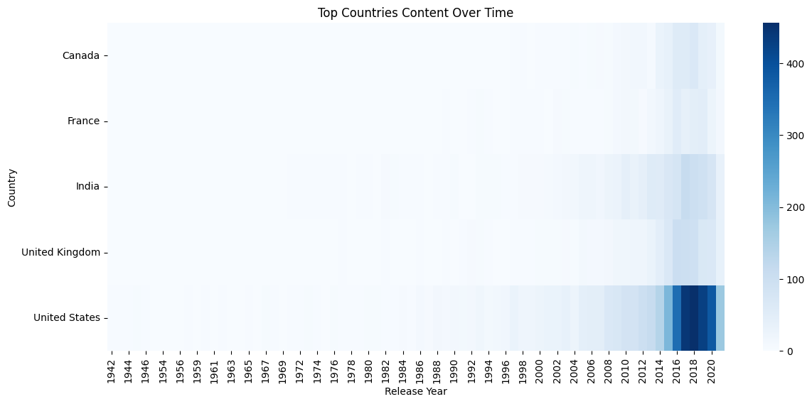

# Netflix Content Analysis

This project explores Netflix's catalog using Python and data analysis techniques.

## 📊 Technologies Used
- Python
- Pandas
- Matplotlib
- Seaborn

## 🎯 Objectives
- Understand Netflix content distribution
- Analyze trends over time
- Explore top genres and countries
- Examine movie duration patterns

## 🔍 Key Insights

- Movies dominate Netflix content compared to TV Shows
- Content production increased significantly after 2015
- Drama and Comedy are the most common genres
- International TV shows highlight Netflix’s global expansion
- The United States, India, and the UK are top content producers
- Most movies are between **80–120 minutes**

## 📈 Sample Visualizations

### Content Types

### Top Genres

### Top Countries

### Movie Duration

## 📌 Methodology

- Data cleaning (handling missing values)
- Feature transformation (splitting multi-value columns)
- Exploratory data analysis (EDA)
- Visualization for insights

## 📊 Additional Visualizations

### Yearly Trend

### Ratings

### Country Heatmap
